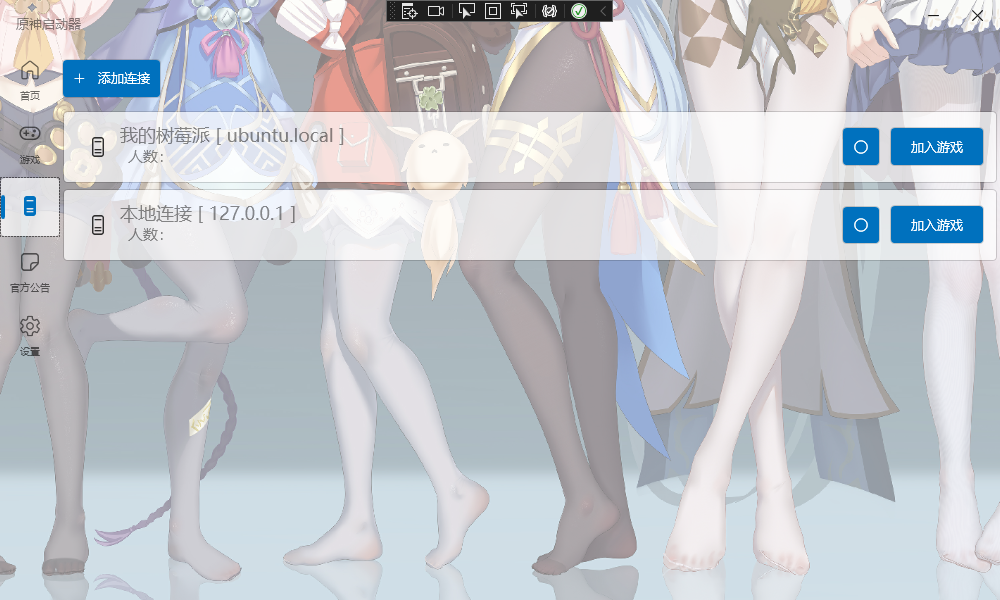

# GenshinImpact_Lanucher
> 一个原神启动器项目，正在完善，界面基于WPF-UI制作，采用微软MVVM框架。

## 特性

 + 自带代理系统 [基于 titanium-web-proxy 项目](https://github.com/justcoding121/titanium-web-proxy)（服务端仅需开启服务器即可，无需开启mitmproxy等其他代理）
 + 多服务器选择
 + 仅代理/解密 游戏相关域名的流量，不影响访问其他域名。

## TODO List
  - [x] 启动游戏相关
    - [x] 客户端切换（b服/官服）
    - [x] 自定义启动窗口（大小/无边框）  
    - [x] 自定义启动器背景
  - [ ] 服务器相关
    - [x] 自带代理，支持非默认端口，只需在ip后加上端口即可，例如: 127.0.0.1:25565
    - [x] 多服务器切换
    - [x] 服务器状态查看
    - [ ] 便捷的命令生成/执行 即参考 [jie65535/GrasscutterCommandGenerator](https://github.com/jie65535/GrasscutterCommandGenerator) 项目的功能
    - [ ] 账户操作相关（注册、登录）
  - [ ] 游戏相关
    - [x] 实时便笺
    - [ ] 解锁帧率
  - [ ] 其他待增加的功能
    - [ ] 自定义背景图
    - [ ] 显示布局优化

### 程序获取请到程序 [Realease](https://github.com/123456fsdaf/GenshinImpact_Lanucher/releases) 下载
### 想体验新功能？请到 [Actions](https://github.com/123456fsdaf/GenshinImpact_Lanucher/actions) 下载最近编译的版本。

### 目前仅支持Win7以上计算机运行该程序

# 项目引用
图片引用地址[wallhaven.cc](https://wallhaven.cc/w/3z9wv3)
 
解锁帧率：[DGP.Genshin.FPSunlocking](https://github.com/DGP-Studio/DGP.Genshin.FPSUnlocking)
